# 📸 FPGA 기반 실시간 4컷 포토부스 (OV7670 + VGA)

FPGA 보드 위에서 카메라 입력부터 필터링, 스티커/낙서 편집, 4컷 합성, 출력 전송까지 전 과정을 하드웨어로 구현한 실시간 포토부스 시스템입니다. OV7670 카메라로 촬영한 영상을 VGA로 실시간 미리보기하면서, 마커 인식 기반 스티커 배치와 손그림(낙서) 편집을 거쳐 4컷 사진을 합성하고 UART로 결과 이미지를 PC에 전송합니다.

> 팀 프로젝트 — 김한림, 김예담, 김유정, 홍다훈, 최민영, 권동오, 박지원 (2조)

## 📌 Overview

| 항목 | 내용 |
|---|---|
| 카메라 | OV7670 (I2C 설정, 320×240 캡처) |
| 출력 | VGA (640×480, 60Hz 표준 타이밍) |
| PC 전송 | UART (1Mbps, 상태값 + 픽셀 데이터) |
| 촬영 컷 수 | 4컷 (자동 연속 촬영) |
| 필터 | Grayscale, Sepia, Soft Focus, Film Look, None |
| 편집 기능 | 마커 기반 스티커 배치, 손그림(Draw/모자이크) |
| 조작 | 버튼(중앙/상하좌우) + 슬라이드 스위치 2개 + 외부 버튼 |

## ✨ Features

- **카메라 → 다운스케일 → 필터 → 캡처 파이프라인**: OV7670에서 들어온 프레임을 `capture_downscaler`로 축소한 뒤 4가지 필터(Grayscale/Sepia/Soft Focus/Film Look) 중 선택 적용하고, `Capture_Controller`가 요청을 받아 프레임 메모리에 기록
- **마커 인식 기반 스티커 배치**: 색상 LUT(`marker_lut.mem`) 기반 `MarkerDetector_final`이 실시간 영상에서 지정 색 마커를 검출·추적하고, 검출 좌표에 맞춰 4종 스티커(`sticker_rom`)를 프레임 메모리에 합성
- **손그림 낙서 / 모자이크 편집**: `StrokeInterpolator`가 빠르게 움직이는 마커 좌표 사이를 보간해 끊기지 않는 선을 그리고, 스위치로 낙서(Draw) 모드와 모자이크 모드를 전환
- **단일 FSM 기반 전체 흐름 제어**: `system_controller`가 대기(OPEN) → 촬영(SHOOT) → 캡처(CAPTURE, 4컷 반복) → 스티커(STICKER) → 낙서(DRAW) → 최종 합성/전송(FINAL_EXPORT) → 결과 화면(RESULT) 7단계 상태를 관리하고, 각 단계의 진행 상태를 32비트 상태 코드로 UART에 함께 전송
- **결과 화면 자동 복귀**: `result_auto_restart`가 RESULT 상태에서 일정 시간(기본 20,000 tick) 경과 또는 외부 버튼 입력 시 자동으로 시스템을 초기 상태로 복귀
- **UART 기반 결과 이미지 전송**: `UART_Interface_Top`이 상태 데이터와 최종 합성 이미지를 지정 보율로 PC에 순차 전송, `Send_Control`이 상태/픽셀 전송을 조정
- **비동기 클럭 도메인 안전 처리**: 카메라 픽셀 클럭(`cam_pclk`)과 시스템 클럭(`clk`) 사이의 신호는 2단 동기화(ASYNC_REG) 및 toggle 방식으로 CDC(Clock Domain Crossing) 안전하게 전달

## 🏗️ Architecture

### 전체 시스템 블록도

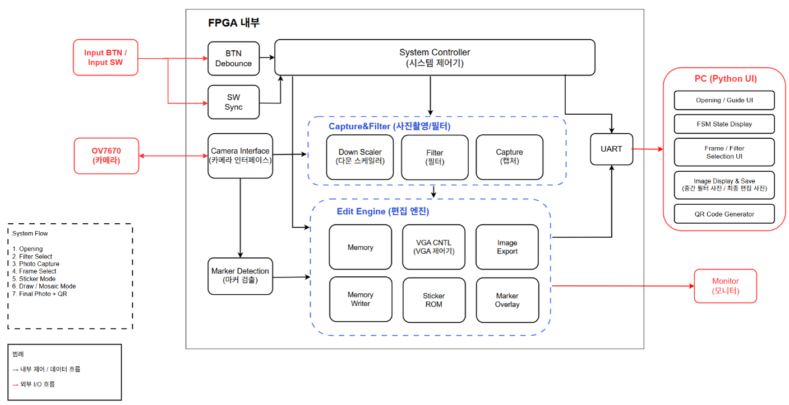

> System Flow: ① Opening → ② Filter Select → ③ Photo Capture(4컷) → ④ Frame Select → ⑤ Sticker Mode → ⑥ Draw/Mosaic Mode → ⑦ Final Photo + QR. FPGA 내부는 BTN Debounce/SW Sync → System Controller → Capture&Filter → Edit Engine → UART 순으로 데이터가 흐르고, PC(Python UI) 쪽에서 진행 안내, FSM 상태 표시, 필터/프레임 선택, 이미지 표시·저장, QR코드 생성을 담당합니다. (PC측 Python UI 소스는 이 저장소에 포함되어 있지 않습니다.)

### 전체 데이터 흐름 (모듈 단위)

```
OV7670 카메라 (I2C 설정 top_setup / Cam_IF)
        │  cam_pclk 도메인
        ▼
ov7670_mem_controller — 프레임 캡처 (320×240, 16bit RGB565)
        │
        ▼
MarkerDetector_final — 색상 LUT 기반 마커 검출/추적 (CDC 동기화 후 시스템 클럭 도메인 전달)
        │
        ▼
system_controller_top (FSM 최상위)
   ├─ system_controller — 상태 머신 (OPEN→SHOOT→CAPTURE→STICKER→DRAW→FINAL_EXPORT→RESULT)
   ├─ button_debounce / switch_sync — 버튼·스위치 입력 정제
   ├─ tick_gen — 기준 tick 생성
   └─ result_auto_restart — RESULT 상태 자동 복귀
        │
        ▼
capture_top
   ├─ capture_downscaler — 다운스케일
   ├─ filter_top — Grayscale/Sepia/SoftFocus/FilmLook 필터 선택 적용
   └─ Capture_Controller — 4컷 순차 캡처, 프레임 메모리 기록
        │
        ▼
edit_engine
   ├─ mem_addr_gen / memory — 편집용 프레임 메모리 R/W
   ├─ mem_writer + sticker_rom — 마커 위치에 스티커 합성
   ├─ marker_overlay — 마커 위치 시각적 표시
   └─ StrokeInterpolator — 낙서 좌표 보간
        │
        ├──► vga_controller — 640×480 VGA 실시간 출력 (미리보기/결과 화면)
        │
        └──► final_frame_sender ──► UART_Interface_Top (Send_Control, Baud_Generator, UART_TX)
                                          │
                                          ▼
                                    PC로 최종 이미지 + 상태 전송
```

### 시스템 FSM (system_controller.sv)

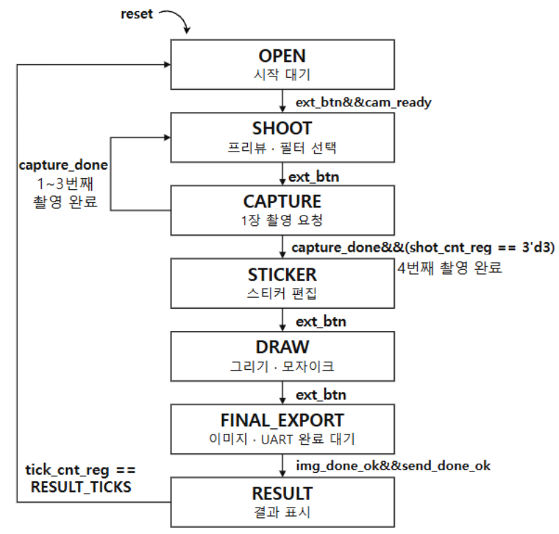

| 상태 | 설명 | 다음 상태 전이 조건 |
|---|---|---|
| `S_OPEN` | 대기 화면, 카메라 준비 대기 | 외부 버튼 입력 + 카메라 준비 완료 → SHOOT |
| `S_SHOOT` | 실시간 미리보기, 필터 선택(버튼R로 순환) | 외부 버튼 → CAPTURE |
| `S_CAPTURE` | 1컷 캡처 진행 | 캡처 완료 시 컷 카운트 증가, 4컷(0~3) 완료 시 STICKER, 아니면 SHOOT로 복귀해 반복 |
| `S_STICKER` | 스티커 선택(버튼R) 및 배치(버튼L), 크기 조절(버튼U/D) | 외부 버튼 → DRAW |
| `S_DRAW` | 낙서 색상 선택(버튼R), 낙서 On/Off(버튼L), 모자이크 모드(스위치) | 외부 버튼 → FINAL_EXPORT |
| `S_FINAL_EXPORT` | 최종 이미지 합성 및 UART 전송 | 이미지 전송 완료 + 상태 전송 완료 → RESULT |
| `S_RESULT` | 결과 화면 표시 | 일정 시간 경과 또는 외부 버튼 → 자동 재시작(OPEN) |

<details>
<summary>System Controller 세부 다이어그램 더보기</summary>

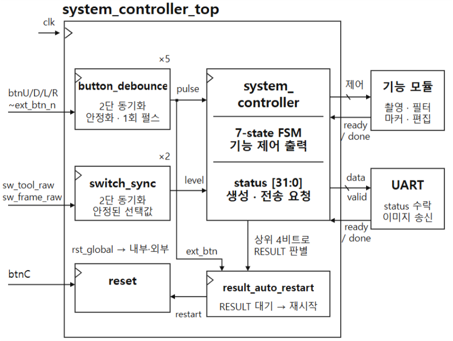
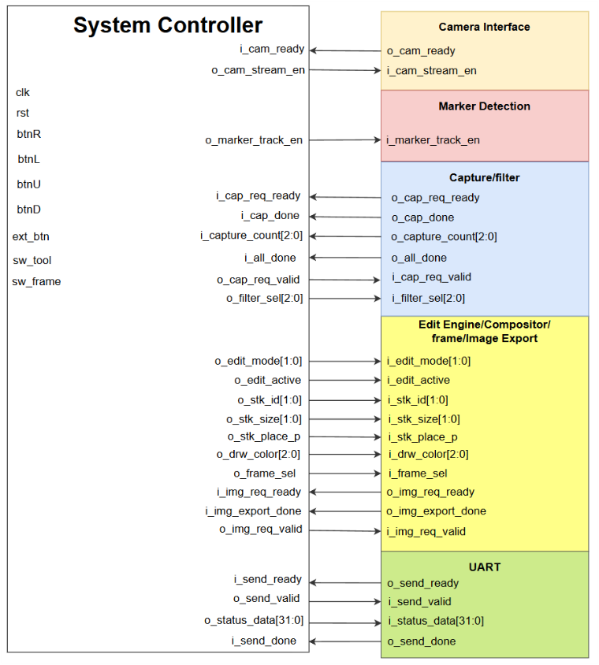
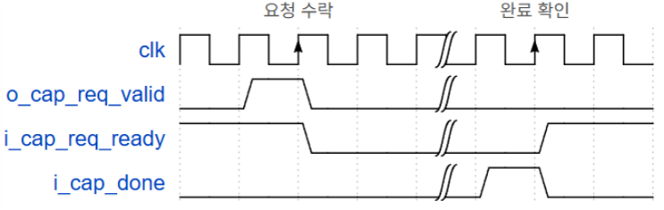
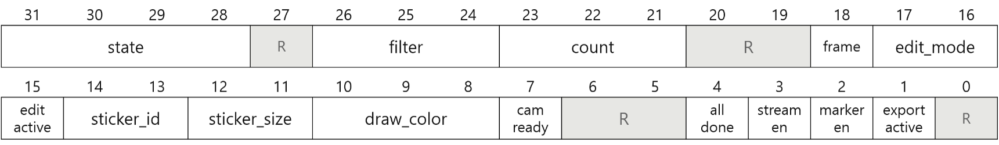

</details>

### 모듈별 블록도

**카메라 인터페이스 (Cam_IF)** — OV7670 I2C 초기 설정(`top_setup`→`setup_fsm`→`I2C_Master_top`)과 프레임 캡처(`ov7670_mem_controller`)를 담당합니다.

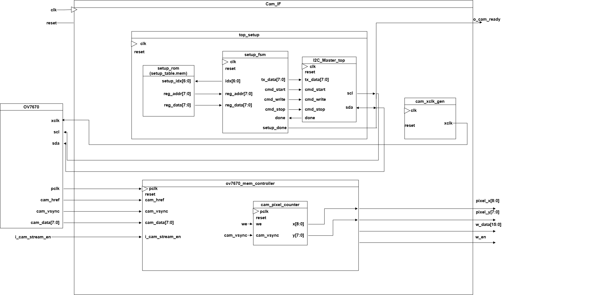

**캡처 & 필터 (Capture_top)** — 다운스케일 → 필터 선택 → 4컷 캡처 제어까지의 파이프라인입니다.

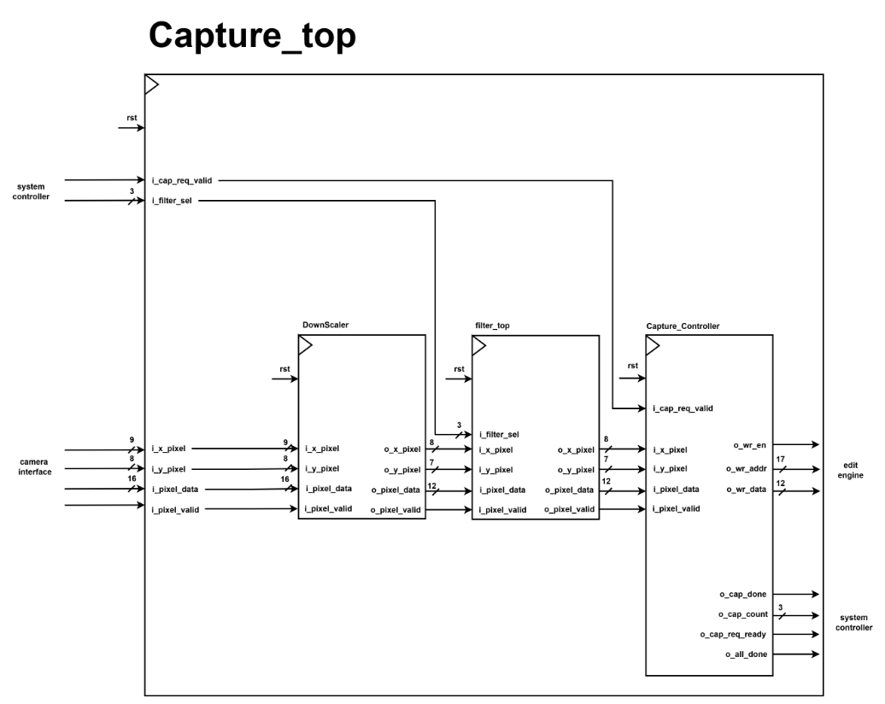
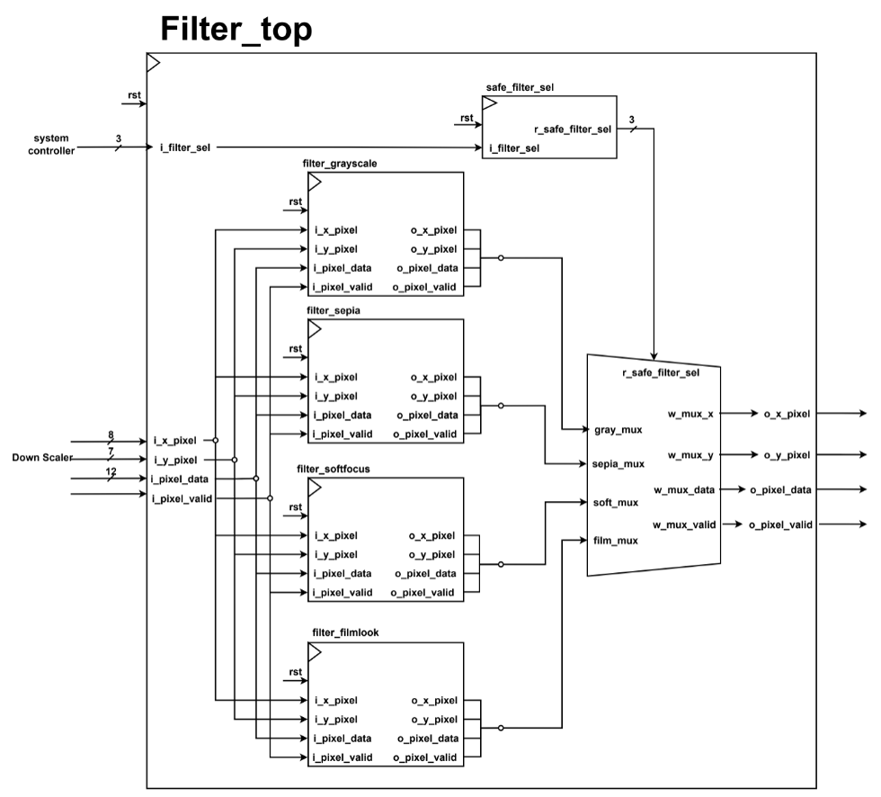
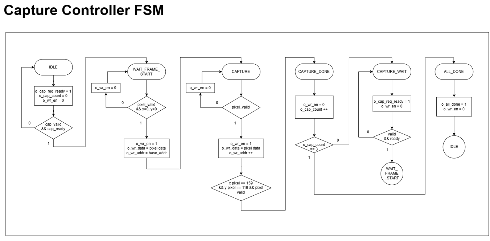

**편집 엔진 (Edit Engine)** — 프레임 메모리 R/W, 마커 기반 스티커 합성, VGA 출력, UART 전송을 위한 이미지 익스포트를 통합 관리합니다.

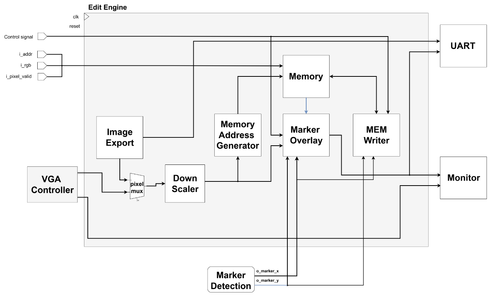
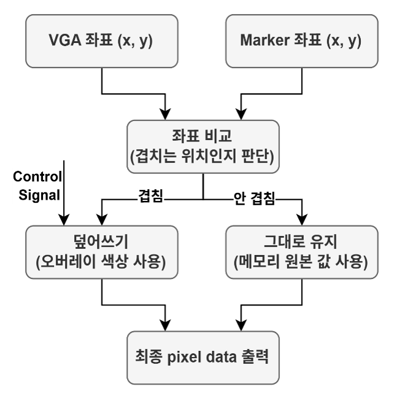
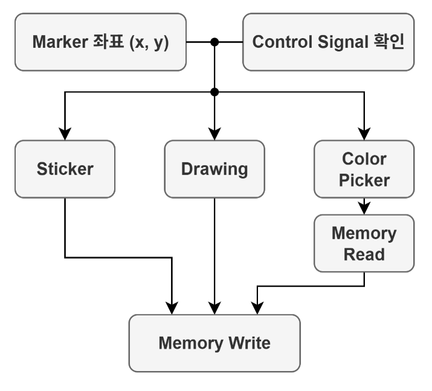
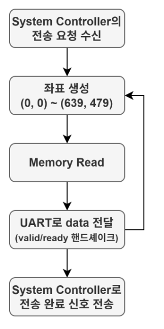

**UART 인터페이스** — 상태 데이터(32bit)와 최종 합성 이미지 픽셀을 순서대로 PC(Python)로 전송합니다.

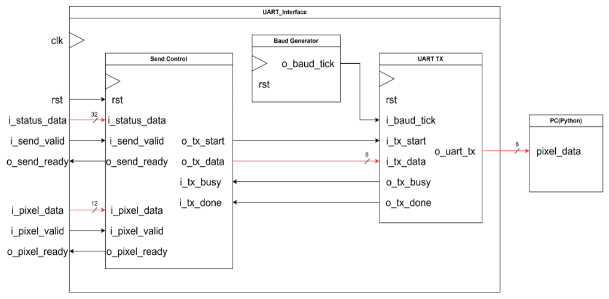

<details>
<summary>UART 상태 다이어그램(ASM) 더보기</summary>

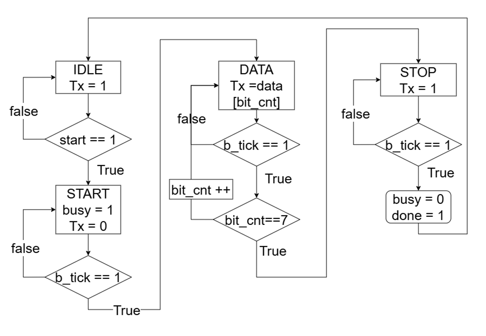
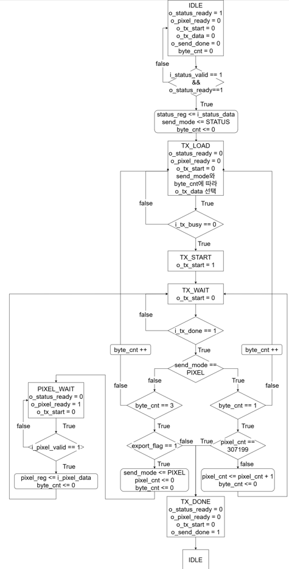

</details>

## 📁 폴더 구성

```
VGA_Photobooth/
├── code/                       # 전체 SystemVerilog 소스 (41개 파일)
│   ├── photobooth_top.sv       # 최상위 모듈
│   ├── system_controller_top.sv / system_controller.sv   # 전체 FSM
│   ├── Cam_IF.sv / ov7670_mem_controller.sv / top_setup.sv / setup_fsm.sv / setup_rom.sv / setup_table.mem / i2c_master-775d884a.sv   # 카메라 인터페이스
│   ├── capture_top.sv / Capture_Controller.sv / DownScaler.sv   # 캡처 파이프라인
│   ├── filter_top.sv / filter_grayscale.sv / filter_sepia.sv / filter_softfocus.sv / filter_filmlook.sv   # 필터
│   ├── MarkerDetector_final.sv / marker_lut.mem / marker_overlay.sv / StrokeInterpolator.sv   # 마커 인식 및 낙서
│   ├── edit_engine.sv / mem_addr_gen.sv / mem_writer.sv / memory.sv / sticker_rom.sv / sticker_rom_4slot.mem / downscaler-6987900f.sv / final_frame_sender.sv   # 편집/합성
│   ├── vga_controller.sv       # VGA 출력
│   ├── UART_Interface_Top.sv / Send_Control.sv / Baud_Generator.sv / UART_TX.sv   # UART 전송
│   └── button_debounce-38588bf9.sv / switch_sync.sv / reset_sync.sv / tick_gen.sv / result_auto_restart.sv   # 입력/타이밍 유틸리티
├── images/                     # 설계 블록도 17장 + Trouble Shooting 슬라이드 2장
└── docs/
    └── 2팀_4컷포토부스_발표자료.pptx   # 팀 발표자료 (슬라이드 대부분 이미지 기반)
```

## 🔧 Trouble Shooting

| 문제 상황 | 원인 분석 | 해결 방안 | 결과 |
|---|---|---|---|
| Vivado Timing Analysis 결과 **WNS -5.156ns, TNS -2616.955ns, Failing Endpoint 648개** 발생 (Timing constraints not met) | 화면 좌표를 메모리 주소로 변환하는 `mem_addr_gen`의 VGA 픽셀 주소 계산과 `mem_writer`의 Sticker·Color Picker Write 주소 계산 경로가 Critical Path로 분석됨. 좌표 변환과 곱셈·덧셈 연산이 한 사이클에 몰려 수행되면서 조합 논리 경로 지연이 누적 | 곱셈 계산 경로에 **파이프라인 레지스터 2단 삽입**: ① 다운스케일 적용된 x_pixel, y_pixel을 레지스터에 저장 → ② 저장된 좌표로 주소 계산(곱셈) 수행 후 결과를 다시 출력 레지스터에 저장하여 주소 계산 경로를 분리 | WNS **-5.156ns → +0.463ns**, TNS **-2616.955ns → 0ns**, Failing Endpoint **648개 → 0개**로 Timing Constraint 충족 |

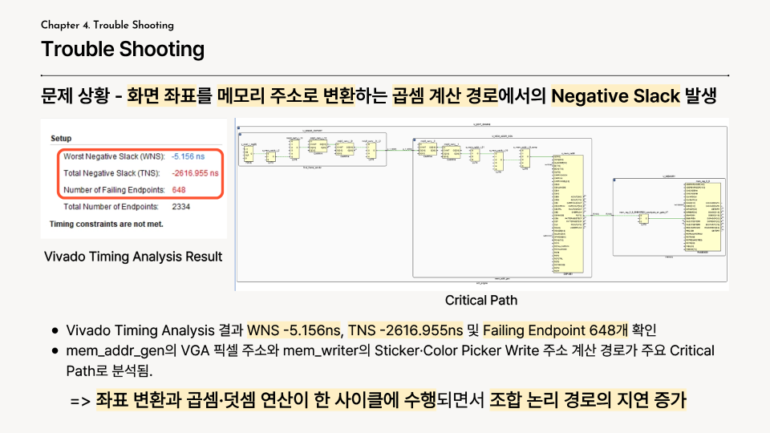
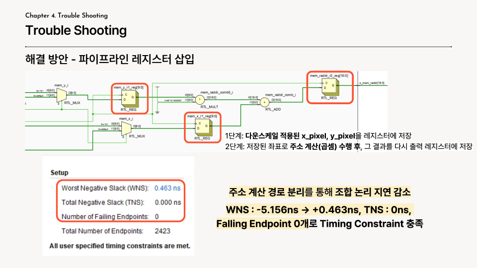

## 🛠️ 설계 시 고려 사항

- **CDC(Clock Domain Crossing) 안전성**: 카메라 픽셀 클럭 도메인에서 검출된 마커 좌표를 시스템 클럭 도메인으로 넘길 때, 좌표 값을 유지한 채 toggle 신호를 2단 ASYNC_REG로 동기화하여 이벤트 유실 없이 안전하게 전달하도록 설계했습니다.
- **필터 전환 시 프레임 경계 동기화**: `filter_top`에서 필터 선택 값을 프레임 시작 시점(x=0, y=0)에서만 래치하여, 프레임 중간에 필터를 바꿔도 한 프레임 내에서 필터가 섞이지 않도록 처리했습니다.
- **단일 상태 코드로 통합된 진행 상태 전송**: FSM의 각 단계별 세부 정보(필터 선택, 캡처 카운트, 스티커/낙서 설정 등)를 32비트 상태 코드 하나로 패킹해 UART로 전송함으로써, PC 쪽에서 별도 프로토콜 파싱 없이 진행 상태를 추적할 수 있도록 했습니다.
- **RESULT 화면 자동 복귀**: 사용자가 별도 조작을 하지 않아도 일정 시간 후 자동으로 초기 화면으로 복귀하도록 하여, 포토부스 특성상 다음 사용자가 바로 이어서 사용할 수 있게 설계했습니다.

## 👥 Team

김한림, 김예담, 김유정, 홍다훈, 최민영, 권동오, 박지원 (2조)

## ⚙️ Design Environment

- Language: SystemVerilog
- Camera: OV7670 (I2C 제어, 320×240 캡처)
- Display: VGA (640×480 @ 60Hz)
- PC 연동: UART (Baud Rate 설정 가능, 기본 1Mbps)
- 개발 보드: FPGA (Basys3)
